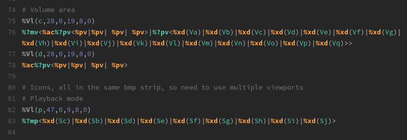

# Rockbox Syntax Highlighting

 Rockbox theming language Syntax Highlighting and auto-complete support for modern text editors. 

## Current Platforms

**GTKSourceView** - Used in some Linux text editors like gedit and Gnome Text Editor. Highlighting has separate theming for regular tags, conditional tags, preloaded elements as well as strings, numbers and comments. Place the rockbox.lang file in /usr/share/gtksourceview-5/language-specs to use. 

## Planned Platforms and Features

**Sublime-Text** - Sublime Text support will include syntax highlighting as well as support for auto-complete.

**Visual Studio** - Visual Studio support will arrive as a plugin, support syntax highlighting, auto-complete and snippets.